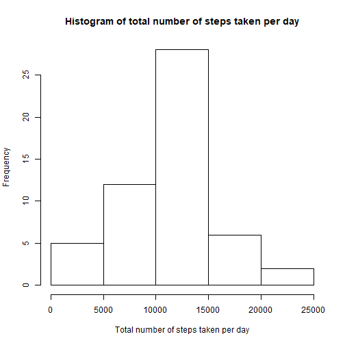
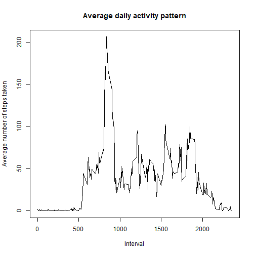
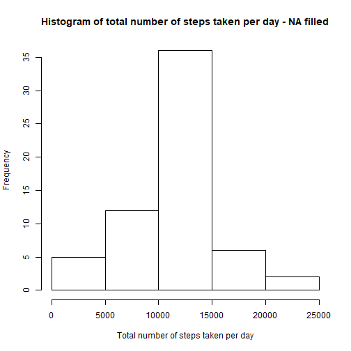
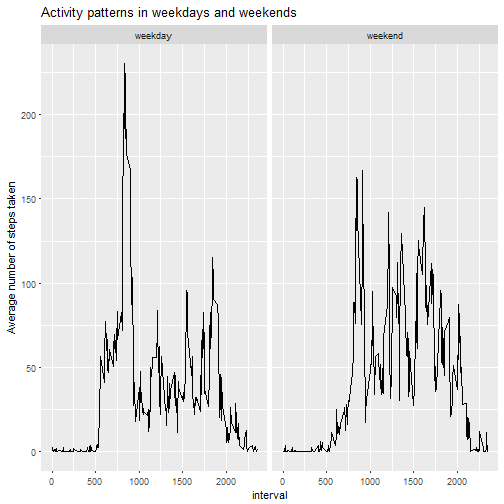

# Reproducible Research Course Project 1

## Step 1 - Load packages dplyr and ggplot2


```r
library(dplyr)
library(ggplot2)
```

## Step 2 - Read the source data into the dataframe - rawdf


```r
rawdf <- read.csv('C:/Users/Sam/Documents/RepData/RepData_PeerAssessment1/activity.csv', na.strings = "NA")
rawdf$date <- as.Date(rawdf$date)
```

## Step 3 - Calculate the total number of steps taken each day for the histogram plot below


```r
stepbydates <- group_by(rawdf, date) %>% summarise(sumsteps = sum(steps))
```

## Step 4 - Plot the histogram showing the frequency distribution of total number of steps taken each day


```r
hist(stepbydates$sumsteps, xlab = 'Total number of steps taken per day', main = 'Histogram of total number of steps taken per day')
```



## Step 5 - Calculate the mean and median of the total number of steps taken per day


```r
mean_step <- mean(stepbydates$sumsteps, na.rm = TRUE)
median_step <- median(stepbydates$sumsteps, na.rm = TRUE)
```

The mean and median of the total number of steps taken per day are 1.0766189 &times; 10<sup>4</sup> and 10765 respectively.

## Step 6 - Calculate the average steps of each interval across all days for the time series plot below


```r
Avg_Steps_byIntervals <- group_by(rawdf, interval) %>% summarise(AvgSteps = mean(steps, na.rm = TRUE))
```

## Step 7 - Plot a time series where x axis is the 5 minute interval and the y axis is the average steps across days


```r
plot(Avg_Steps_byIntervals$interval, Avg_Steps_byIntervals$AvgSteps, type = 'l', xlab = 'Interval', ylab = 'Average number of steps taken', main = 'Average daily activity pattern')
```



## Step 8 - Identify the 5 minute interval containing the maximum number of average steps across all days


```r
max_interval <- Avg_Steps_byIntervals$interval[ which(Avg_Steps_byIntervals$AvgSteps == max(Avg_Steps_byIntervals$AvgSteps))]
```

The interval contains the maximum number of average steps across all days is 835.

## Step 9 - Find out number of missing values in the source data


```r
missing_rcds <- sum(is.na(rawdf$steps))
```

There are 2304 missing records in the source dataset.

## Step 10 - Fill in the missing value by using the avearge steps of each interval across all days found in step 6 and store the result in a new dataframe called rawdf_2


```r
rawdf_2 <- left_join(rawdf, Avg_Steps_byIntervals, by = 'interval')
rawdf_2 <- mutate(rawdf_2, steps = ifelse(is.na(steps), AvgSteps, steps))
```

## Step 11 - Calculate the daily total number of steps taken by using the new dataframe created in Step 10


```r
stepbydates_2 <- group_by(rawdf_2, date) %>% summarise(sumsteps = sum(steps))
```

## Step 12 - Plot the histogram showing the total number of steps taken in the dataframe rawdf_2


```r
hist(stepbydates_2$sumsteps, xlab = 'Total number of steps taken per day', main = 'Histogram of total number of steps taken per day - NA filled')
```



## Step 12 - Calculate the mean and median of the total number of steps taken each day in the dataframe rawdf_2


```r
mean_step_2 <- mean(stepbydates_2$sumsteps, na.rm = TRUE)
median_step_2 <- median(stepbydates_2$sumsteps, na.rm = TRUE)
```

The mean and median of the total number of steps taken per day, after filling all the missing values, are 1.0766189 &times; 10<sup>4</sup> and 1.0766189 &times; 10<sup>4</sup> respectively.

## Step 13 - Add a new column classifying weekdays and weekends (2 factors) and store the result in the new dataframe rawdf_3


```r
rawdf_3 <- mutate(rawdf_2, WkDays = ifelse(weekdays(date) %in% c('Saturday', 'Sunday'), 'weekend', 'weekday'))
rawdf_3[,'WkDays'] <- as.factor(rawdf_3$WkDays)
```

## Step 14 - Calculate average steps taken in each interval throughout Weekdays and Weekends


```r
Avg_Steps_byIntervals_WkDayEnd <- group_by(rawdf_3, WkDays, interval) %>% summarise(AvgSteps = mean(steps, na.rm = TRUE))
```

## Step 15 - Use ggplot to show the difference between the distributions of average steps taken in each interval during weekdays and weekends


```r
g <- ggplot(Avg_Steps_byIntervals_WkDayEnd, aes(interval, AvgSteps))
g + geom_line() + facet_grid(.~WkDays) + labs(y = 'Average number of steps taken', title = 'Activity patterns in weekdays and weekends')
```


